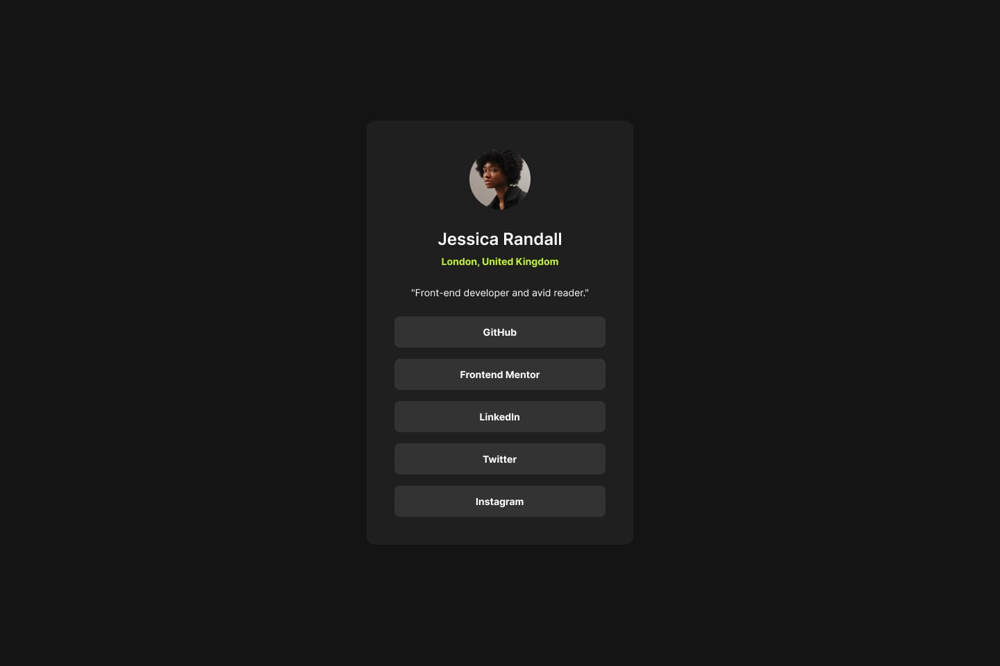
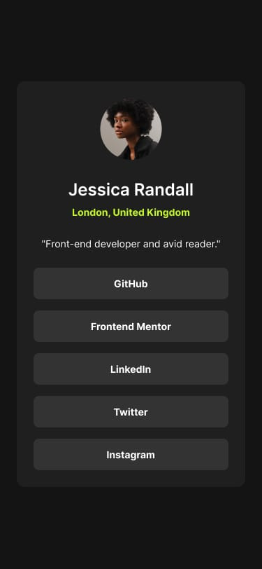

# Frontend Mentor - Social links profile solution

Frontend Mentor - [Social links profile](https://www.frontendmentor.io/challenges/social-links-profile-UG32l9m6dQ)

## Table of contents

- [Overview](#overview)
  - [Screenshot](#screenshot)
  - [Links](#links)
- [My process](#my-process)
  - [Built with](#built-with)
  - [What I learned](#what-i-learned)
  - [Continued development](#continued-development)
- [Author](#author)


## Overview

### Screenshot

|  |  |
|:--:|:--:|
| Desktop | Mobile |

### Links

- Solution URL: [Frontend Mentor](https://www.frontendmentor.io/solutions/social-links-profile-9YF16ZkIz1)
- Live Site URL: [Github Pages](https://rahulpaul127.github.io/fm-social-links-profile-main/)

## My Process

### Built with
- Semantic HTML5 markup
- CSS custom properties
- Flexbox
- @font-face rule for custom local fonts
- clamp() for fluid typography and responsive sizing

## What I learned

This project was all about clamp(). It was kinda confusing at first, but I got to know it more deeply now. It saves a lot of time by handling responsiveness in one line, which means no more writing multiple @media queries. It was great to learn.

## Continued development

I'm excited to learn more things and definitely want to keep using clamp() until it feels effortless and natural to use.

```css
.social-container {
  width: clamp(0rem, 100vw - 40px, 23.75rem);
}
```

## Author

- Frontend Mentor - [@rahulpaul127](https://www.frontendmentor.io/profile/rahulpaul127)
- Twitter - [@rahulpaul127](https://x.com/rahulpaul127)
